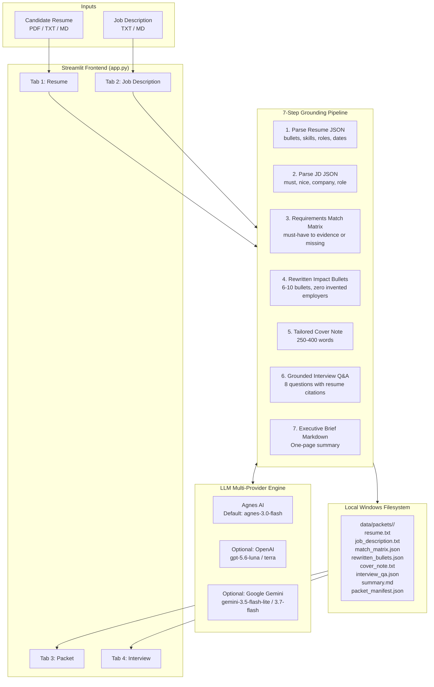

# Architecture

Architecture and data flow for the Job Packet desktop application.

## System overview

Job Packet processes resumes and job descriptions locally to produce application materials and interview preparation notes.



## Pipeline stages

### 1. Resume parsing
The parser accepts text from uploaded PDF files (extracted with `pypdf`), text files, or Markdown documents. It calls the language model to extract a JSON object with four primary keys: `bullets`, `skills`, `roles`, and `dates`.

```json
{
  "bullets": ["Processed 450,000 sensor events/sec...", "..."],
  "skills": ["Python", "gRPC", "Redis", "..."],
  "roles": ["Senior Flight Systems Engineer at Zephyr Skyworks", "..."],
  "dates": ["March 2022 to Present", "June 2019 to February 2022"],
  "employers": ["Zephyr Skyworks", "Nebula Cloud Foundry"]
}
```

The parser also records the candidate's employers. Downstream steps use this list to check that the generator does not invent new employer names.

### 2. Job description parsing
The job description parser converts the job posting into structured JSON:

```json
{
  "must": ["5+ years distributed Python backend", "Real-time telemetry pipelines", "..."],
  "nice": ["DO-178C aerospace standards", "Rust", "..."],
  "company": "Starlight Propulsion Inc.",
  "role": "Principal Autonomous Systems Architect"
}
```

### 3. Requirements match matrix
The pipeline matches each requirement from the `must` list against the candidate's resume facts. Each item is marked `matched`, `partial`, or `missing`. If the resume does not show direct evidence for a requirement, the status and evidence fields are set to `missing`.

### 4. Rewritten bullets
The generator produces 6 to 10 bullet points tailored to the target role. The prompt includes the candidate's verified employers and instructs the model not to add companies or clients outside that list. A post-generation check scans the text for company names and flags any employer not in the source resume.

### 5. Tailored cover note
The model writes a cover note addressed to the hiring team between 250 and 400 words. The text draws only from verified projects, tools, and employers in the resume. If the initial draft falls outside the 250 to 400 word range, the pipeline runs a revision pass to fit the target length.

### 6. Grounded interview questions
The pipeline produces 8 interview questions covering system design, technical details, behavioral scenarios, and project trade-offs. Each question includes an answer outline citing specific resume bullets.

```json
[
  {
    "id": 1,
    "category": "System Architecture",
    "question": "How do you handle sub-5ms latency across high-throughput edge nodes?",
    "grounded_answer": "In my work at Zephyr Skyworks, I architected a distributed pipeline in Python and Go...",
    "resume_evidence": "- Architected a distributed high-throughput telemetry ingestion pipeline in Python and Go..."
  }
]
```

### 7. One-page summary
The pipeline creates an executive summary in Markdown with the alignment score, a requirements table, top bullet points, and verified skills.

### 8. Employer and school entity audit scan
Python scans all generated text (bullets, cover note, interview answers, and summary) for employer and educational institution names. Any entity not present in the raw resume text is flagged in the UI and stored in `audit_results.json`.

## Storage layout

Each generated packet is saved under a timestamped directory in `data/packets/`, and the latest output is mirrored to `data/cache/last_packet.json`:

```
data/
├── cache/
│   └── last_packet.json         # Mirrored latest packet for quick retrieval
└── packets/
    └── 20260919_233714/
        ├── resume.txt               # Raw input resume text
        ├── job_description.txt      # Raw target JD text
        ├── resume_parsed.json       # Structured resume JSON
        ├── jd_parsed.json           # Structured JD JSON
        ├── match_matrix.json        # Requirements match matrix
        ├── rewritten_bullets.json   # 6-10 grounded bullets
        ├── cover_note.txt           # 250-400 word cover letter
        ├── interview_qa.json        # 8 grounded interview Q&A
        ├── summary.md               # One-page executive summary
        ├── audit_results.json       # Grounding audit results
        └── packet_manifest.json     # Packet metadata and counts
```

## Model integration

The app connects to models through the `openai` Python package in `llm_client.py`:

1. **Agnes AI (default):** Uses `agnes-3.0-flash` at `https://apihub.agnes-ai.com/v1` with the `AGNESAI_API_KEY` environment variable.
2. **OpenAI (optional):** Uses `gpt-5.6-luna` or `gpt-5.6-terra`. Requires `OPENAI_API_KEY` and `OPENAI_BASE_URL`.
3. **Google Gemini (optional):** Uses `gemini-3.5-flash-lite` or `gemini-3.7-flash` via Google's OpenAI-compatible endpoint. Requires `GOOGLE_API_KEY`.

If a provider's key is missing from the environment, the app hides that provider from the user interface.
